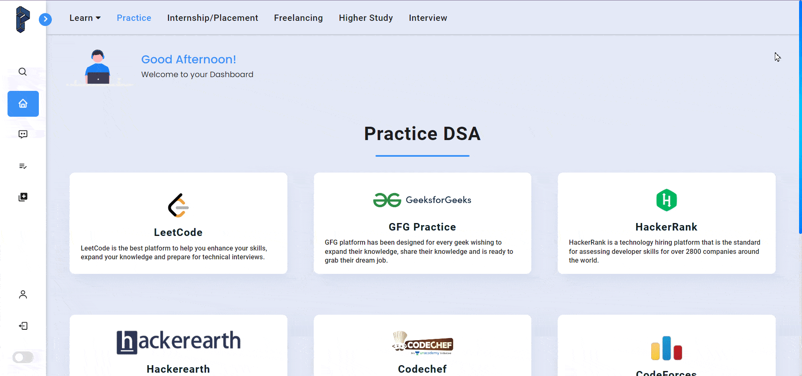

# Pragati



## Introduction
Pragati is a comprehensive educational platform that brings together all the resources that students need to succeed in school and college. With features like learning resources, a to-do list, a chat feature, and a bookmark system, Pragati makes it easier for students to stay organized and motivated.

## Features
- Learning Resources
    Pragati offers a wealth of educational resources, including study materials, tutorials, and practice problems. These resources are sourced from reputable sources and are constantly updated to provide the most relevant information.
    They can also add their own resources, making it easy to personalize their learning experience
- To-Do List
    The to-do list makes it easy for students to keep track of their assignments and tasks
- Chat Feature
     allows students to connect with their peers and educators. They can ask questions, share resources, and collaborate on projects, all within the platform
- Bookmark System
    bookmark system allows students to save their favourite resources for quick and easy access later.
---
## User Authentication API

### Introduction
This API allows users to sign up and log in to access protected resources on your website. It includes two endpoints: `/user/signup` and `/user/login`.

### Endpoints
#### Signup
```http
  POST /user/signup
```
It requires the following parameters in the request body:

| Parameter      | Type     | Description                           |
| :------------- | :------- | :------------------------------------ |
| `firstName`    | `string` | **Required**. First name of the user. |
| `lastName`     | `string` | **Required**. Last name of the user.  |
| `email`        | `string` | **Required**. Email address of user.  |
| `password`     | `string` | **Required**. Password of the user.   |
| `isSchoolStudent` | `boolean` | Optional. Indicates whether the user is a school student or not. Default value is false. |


Example Request Body:
```
{
    "firstName": "Levi",
    "lastName": "Ackerman",
    "email": "levi@scoutregiment.org",
    "password": "password123",
    "isSchoolStudent": false
}
```
Upon successful registration, the API returns a JSON object with a token that can be used for future API calls.
```
{
    "user": {
        "name": "Levi Ackerman",
        "email": "levi@scoutregiment.org",
        "password": "$2a$10$mHLLM/Wdu.eBVs9/iRAVVshUTy",
        "isSchoolStudent": false,
        "_id": "63e8c3ee5"
    },
    "token": "eyJhbGciOiJIUzI1NiIsInR5cCI6IkpXVCJ9.eyJfaWQiOiI2M2U4YzNlZTUyOTY4NWVTUiLCJgWr0WgKfq9ljkJftE"
}
```

#### Login
```http
  POST /user/signup
```
It requires the following parameters in the request body:

| Parameter      | Type     | Description                           |
| :------------- | :------- | :------------------------------------ |
| `email`        | `string` | **Required**. Email address of user.  |
| `password`     | `string` | **Required**. Password of the user.   |

Example Request Body:
```
{
    "email": "levi@scoutregiment.org",
    "password": "password123"
}
```
Upon successful login, the API returns a JSON object with a token that can be used for future API calls.

Example Response:
```
{
    "user": {
        "_id": "63e8c3ee5",
        "name": "Levi Ackerman",
        "email": "levi@scoutregiment.org",
        "password": "$2a$10$mHLLM/Wdu.eBVs9/iRAVVshUTy",
        "isSchoolStudent": false
    },
    "token": "eyJhbGciOiJIUzI1NiI2M2U4YzNlZTUyOTY4NWVmO3oG0l6uNH_H1qebNWRLvlE68mwClkgw"
}
```


---
